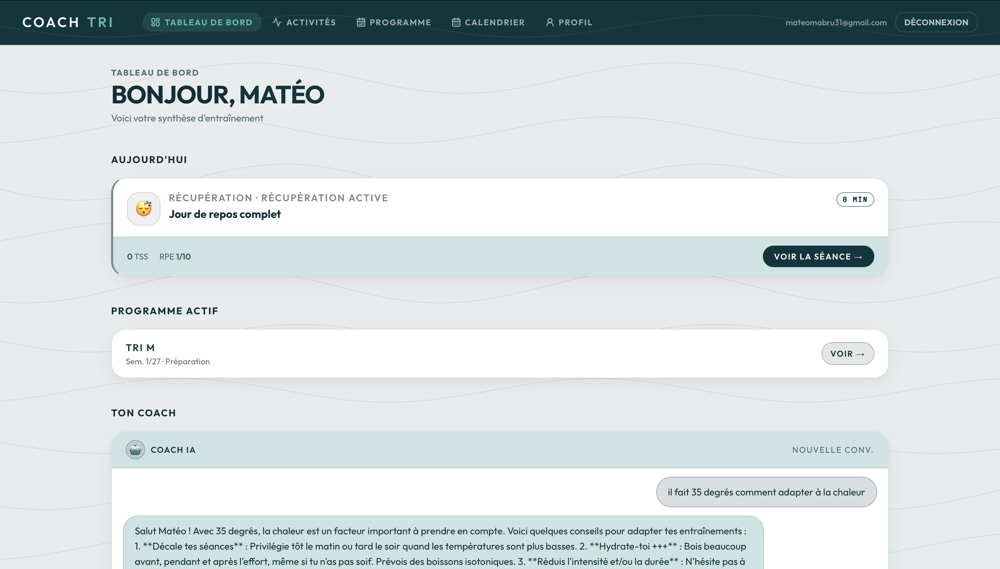
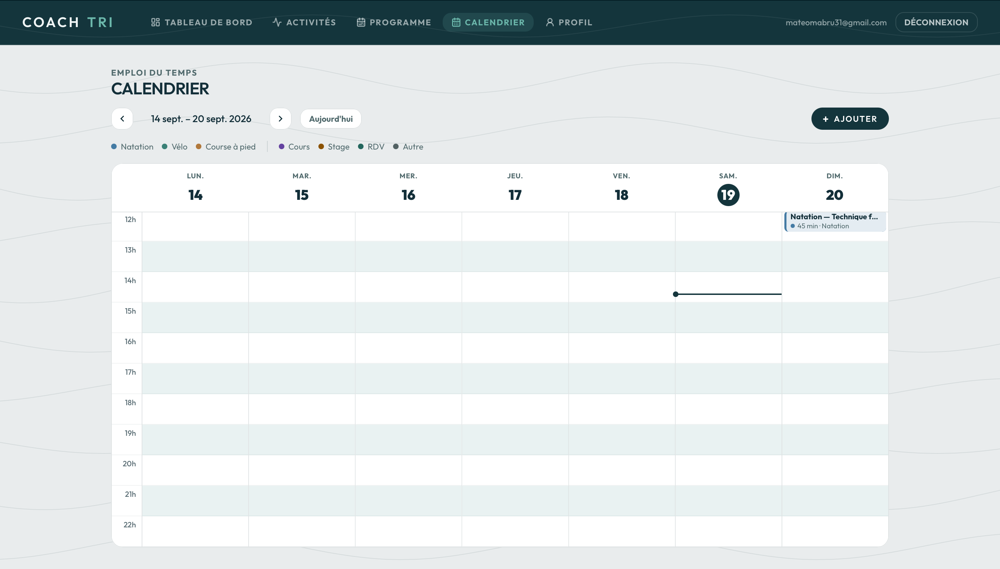
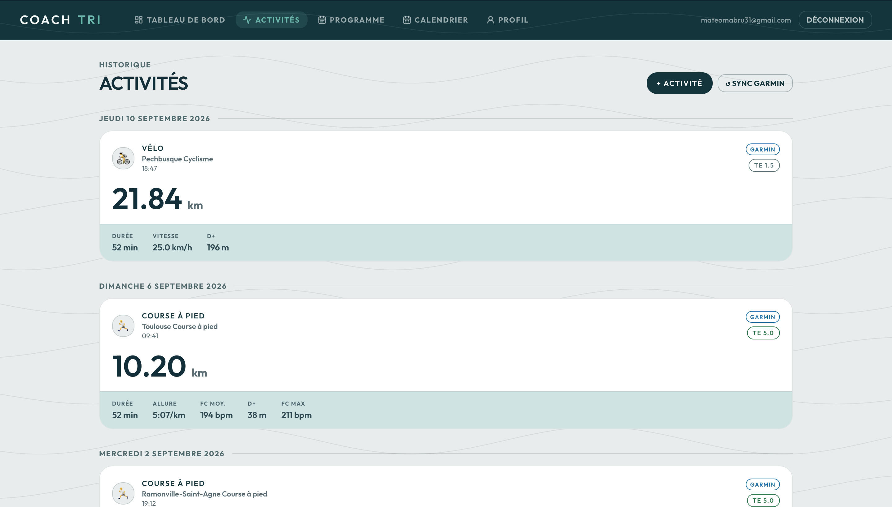

# Coach Tri

> AI-powered triathlon coaching web app — personalized training-plan generation, a conversational AI coach, and unified activity data from Garmin Connect and Strava.


**Live demo:** https://coach-tri-amber.vercel.app

> Personal portfolio project built to explore full-stack product development with Next.js 16, Supabase, and the Google Gemini API — from database schema and auth to AI features and third-party activity sync.

## Screenshots

| Dashboard                                  | AI coach                              |
| ------------------------------------------ | ------------------------------------- |
|  |  |

| Calendar                                 | Activities                                   |
| ---------------------------------------- | -------------------------------------------- |
|  |  |

## Features

- **AI training plans** — generates personalized triathlon training programs with Google Gemini, adapted to the athlete's profile and goals.
- **Conversational AI coach** — a chat coach that answers training questions with context from the athlete's data.
- **Unified activity feed** — activities from Garmin and Strava normalized into a single model.
- **Garmin Connect sync** — imports activity data (credentials encrypted at rest with AES-256).
- **Strava integration** — OAuth2 connection to import activities.
- **Training calendar** — sessions laid out over time.
- **Profile & onboarding** — guided setup capturing the athlete's profile.

## Tech stack

- **Framework:** Next.js 16 (App Router) + React 19
- **Database & Auth:** Supabase (PostgreSQL + SSR Auth)
- **AI:** Google Gemini (`@google/genai`)
- **Activity data:** Garmin Connect (`garmin-connect`) + Strava (OAuth2)
- **UI:** Tailwind CSS v4 + shadcn/ui + lucide-react
- **Validation:** Zod v4 · **Dates:** date-fns v4
- **Testing:** Vitest · **Deployment:** Vercel

## Architecture

The app follows the Next.js App Router structure, with server-side data access
through Supabase and business logic isolated in `src/lib` domain modules.

```
src/
├── app/            # App Router routes (pages, layouts, API route handlers)
├── components/     # UI components grouped by feature (coach, calendar, plan, ...)
├── lib/            # Domain logic: gemini, garmin, strava, plan, activities, supabase
├── types/          # Shared domain + generated database types
```

- **Data & auth** run through Supabase with SSR-aware clients and middleware.
- **AI features** (plan generation, coach chat) are encapsulated in `src/lib/gemini`.
- **Integrations** (`src/lib/garmin`, `src/lib/strava`) handle third-party sync,
  with Garmin credentials encrypted before storage.

## Getting started

**Prerequisites**

- Node.js 20+
- A Supabase project
- A Google AI Studio (Gemini) API key
- (Optional) A Strava app for activity import

**Install & run**

```bash
npm install
cp .env.example .env.local   # then fill in your own values
npm run dev                  # http://localhost:3000
```

Apply the database schema (Supabase migrations):

```bash
npm run db:push
```

## Environment variables

See `.env.example`. Provide your own values for:

| Variable                                    | Description                                                    |
| ------------------------------------------- | -------------------------------------------------------------- |
| `NEXT_PUBLIC_SUPABASE_URL`                  | Supabase project URL                                           |
| `NEXT_PUBLIC_SUPABASE_ANON_KEY`             | Supabase anon key                                              |
| `SUPABASE_SERVICE_ROLE_KEY`                 | Supabase service_role key (server-side only)                   |
| `GEMINI_API_KEY`                            | Google AI Studio key                                           |
| `ENCRYPTION_KEY`                            | AES-256 key to encrypt Garmin credentials (32 chars or 64 hex) |
| `STRAVA_CLIENT_ID` / `STRAVA_CLIENT_SECRET` | Strava app (optional)                                          |
| `NEXT_PUBLIC_APP_URL`                       | Public app URL — used for the Strava OAuth callback            |

## Scripts

| Command                | Purpose                                    |
| ---------------------- | ------------------------------------------ |
| `npm run dev`          | Development server                         |
| `npm run build`        | Production build                           |
| `npm run start`        | Production server                          |
| `npm run lint`         | ESLint                                     |
| `npm run format`       | Format with Prettier                       |
| `npm run format:check` | Check formatting (CI)                      |
| `npm run typecheck`    | TypeScript check (`tsc --noEmit`)          |
| `npm run test`         | Unit tests (Vitest)                        |
| `npm run db:push`      | Apply Supabase migrations                  |
| `npm run db:types`     | Regenerate `src/types/db.ts` from Supabase |

## Testing

Unit tests run with Vitest:

```bash
npm run test
```

## Deployment

Deployed on Vercel. Configure all environment variables in the Vercel project.
For Strava, set the _Authorization Callback Domain_ to the host of
`NEXT_PUBLIC_APP_URL`.

## License

[MIT](./LICENSE) © 2026 Mateo Ferrage
